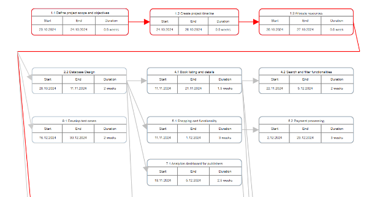
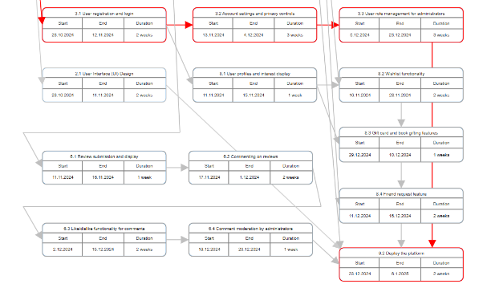
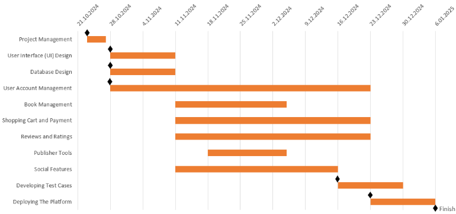



**BOOKBEE**  
PROJECT PLAN

|Course/CRN|Software Engineering *-* 13621, 13607|
| :- | :- |
|Date|26\.10.2024|
|Group Name|Text Traders Team|
|Team Members|
Metin Soyalp - 150210112

Hakan Duran - 150200091

Giray Yıldırım - 150210107

Matay Aydın - 150200075

Emre Çamlıca - 150210071

Burak Toprak - 150200004

Onur Baylam - 150220770
|

# 
# **TABLE OF CONTENTS**

[**TABLE OF CONTENTS	1**](#_wiq55mb6cumz)**

[**1. INTRODUCTION	2**](#_m6ch4olz0xtg)

[1.1 Scope	2](#_lcxen5kscjcs)

[1.2 Deliverables	3](#_5b0n4xh7zaf8)

[1.3 Functional Requirements	4](#_nb8lrjui1xp)

[1.4 Non-Functional Issues	4](#_368ekrk4a2hr)

[**2. PROJECT PLAN	5**](#_p2fr6qj7vha5)

[**3. ESTIMATES	7**](#_rg23h3j9ptj6)

[**4. RESOURCES	8**](#_59o8rjocrlzt)

[**5. SCHEDULE	9**](#_jsdsguf2b85l)

[**6. RISKS	11**](#_py3f5mxp2rku)

# **1.	INTRODUCTION**

The project is an online bookstore platform designed to offer a beautiful shopping experience for customers and an efficient marketplace for publishers. Customers can browse through books, purchase and rate them based on their reading experience. Additionally, users can personalize their interaction by favoriting books or adding them to a wishlist for future purchases. The platform also supports the purchase and sending of gift cards, adding a social place to the software.

Publishers play a key role in this marketplace, where they can directly sell their books to customers. They are provided with analytical tools to visualize customer activity on their books, such as sales data and ratings. This functionality makes the bookstore both a consumer-friendly platform and a robust marketplace for publishers.

## **1.1	Scope**

The electronic bookstore will be a web-based application and allow customers, publishers and administrators to interact with their roles.

- Customer: Customers can create accounts, browse and search for books by genre or price, add books to their cart or wish list, and buy books. They can also write reviews, comment on other reviews, like or dislike comments and send books or gift cards to friends. Customers can add money to their accounts, use coupons, see book recommendations on the homepage and look back at their order history.
- Publisher: Publishers can add books to sell, upload book cover images and book information, see visual data about customer interest, and manage their wallets to receive payments.
- Administrator: Administrators are responsible for keeping the platform safe and managing interactions by removing comments, limiting user access, and managing account statuses.

The project will not include a recommendation system that uses neural networks or reinforcement learning. It will also not provide forums for user discussions. Finally, professional critic reviews will not be available for users to read on the platform.
## 
## **1.2	Deliverables**

|**Deliverable Number**|**Deliverable**|**Delivery Date**|
| :-: | :-: | :-: |
|**1**|Project Plan|27\.10.2024 |
|**1.1**|Scope of Project|27\.10.2024|
|**1.2**|WBS of Project|27\.10.2024|
|**2**|Requirements Specification|05\.11.2024|
|**3**|Design Specification|03\.12.2024|
|**4**|Implementation|24\.12.2024|
|**4.1**|Initial Databases|12\.11.2024|
|**4.2**|User Review|17\.12.2024|
|**4.3**|Book Wish List|17\.12.2024|
|**4.4**|Book Gifting System|17\.12.2024|
|**4.5**|User Authentication|24\.12.2024|
|**4.6**|Payment System|24\.12.2024|
|**4.7**|Admin Panel|24\.12.2024|
|**5**|Test Specification|31\.12.2024|
|**6**|Project Demonstration|07\.01.2025|

## **1.3	Functional Requirements**

|**#**|**Task**|**Deliverable**|
| -: | :-: | :-: |
|**1**|Project Management|1, 1.1, 1.2, 2|
|**2**|User Interface (UI) and Database Design|3, 4.1|
|**3**|User Account Management|3, 4.5|
|**4**|Book Management|3, 4.3|
|**5**|Shopping Cart and Payment|3, 4.6|
|**6**|Reviews and Ratings|3, 4.2|
|**7**|Publisher Tools|3, 4.7|
|**8**|Social Features|3, 4.4|
|**9**|Testing and Deployment|5|

## **1.4	Non-Functional Issues**

**Performance:** The system should efficiently deal with filtering and sorting operations of books based on the attributes of price, author, genre, even for large scale data sets. Functionality for listing and searching for books should support pagination and loading page contents efficiently to prevent potential delays while browsing. The BookBee platform should be able to serve thousands of users at the same time without undermining performance.

**Security:** Users should be able to authenticate their identities safely within the application

using our JWT-based authentication system. Moreover, all sensitive credential information belonging to any kind of user such as passwords will be stored in a hashed manner in the database. Hence, it is aimed to prevent unauthorized access to the system even if the content of the database is compromised.

**Usability:** BookBee application should offer customers and publishers a responsive and consistent experience, as well as providing a seamless administrative management interface. Moreover, the mechanisms for payment functionality can be operated with minimal steps, including easy cart management and smooth purchase confirmation. Furthermore, customers should be able to search for books effectively with recommendations based on their preferences.
# **2.	PROJECT PLAN**
Work breakdown structure (WBS) of the project is given below.

**BookBee**

1\. Project Management (L)

- 1.1 Define project scope and objectives (S)
- 1.2 Create project timeline (M)
  - 1.2.1 Develop milestones (S)
  - 1.2.2 Set deadlines for tasks (S)
- 1.3 Allocate resources (M)

2\. User Interface (UI) and Database Design (XL)

- 2.1 User Interface (UI) Design (L)
  - 2.1.1 Wireframe creation (M)
  - 2.1.2 Mockup design (M)
  - 2.1.3 User experience testing (S)
- 2.2 Database Design (L)
  - 2.2.1 Define schema for all tables (L)
    - 2.2.1.1 User table structure (S)
    - 2.2.1.2 Customer\_Address table structure (S)
    - 2.2.1.3 Friend\_Request table structure (S)
    - 2.2.1.4 Book table structure (S)
    - 2.2.1.5 Genre table structure (S)
    - 2.2.1.6 Wish List table structure (S)
    - 2.2.1.7 Reviews table structure (S)
    - 2.2.1.8 Comments table structure (S)
    - 2.2.1.9 Discounts table structure (S)
    - 2.2.1.10 Coupons table structure (S)
    - 2.2.1.11 Shopping Cart table structure (S)
    - 2.2.1.12 Order/Receipt table structure (S)

3\. User Account Management (XL)

- 3.1 User registration and login (L)
- 3.2 Account settings and privacy controls (M)
- 3.3 User role management for administrators (M)

4\. Book Management (XL)

- 4.1 Book listing and details (L)
  - 4.1.1 Add book functionality for publishers (M)
  - 4.1.2 Display book information (M)
  - 4.1.3 Upload book cover images (S)
- 4.2 Search and filter functionalities (L)
  - 4.2.1 Implement search by title, author, and genre (L)
  - 4.2.2 Create filtering options (e.g., price range, ratings) (M)

5\. Shopping Cart and Payment (XL)

- 5.1 Shopping cart functionality (L)
  - 5.1.1 Add to cart feature (M)
  - 5.1.2 View cart and modify items (M)
  - 5.1.3 Implement cart items table (S)
- 5.2 Payment processing (L)
  - 5.2.1 Secure payment system (L)
  - 5.2.2 Implement wallet loading and withdrawals (M)

6\. Reviews and Ratings (L)

- 6.1 Review submission and display (M)
- 6.2 Commenting on reviews (S)
- 6.3 Like/dislike functionality for comments (S)
- 6.4 Comment moderation by administrators (S)

7\. Publisher Tools (L)

- 7.1 Analytics dashboard for publishers (M)
  - 7.1.1 Sales data visualization (M)

8\. Social Features (L)

- 8.1 User profiles and interest display (M)
- 8.2 Wishlist functionality (M)
- 8.3 Gift card and book gifting features (M)
- 8.4 Friend request feature (M)

9\. Testing and Deployment (L)

- 9.1 Develop test cases (L)
  - 9.1.1 Unit testing for each module (L)
  - 9.1.2 E2E testing (L)
- 9.2 Deploy the platform (M)
# 
# **3.	ESTIMATES**

|**Activity**|**Estimate**|
| :-: | :-: |
|
1\. Project Management

- 1.1 Define project scope and objectives

- 1.2 Create project timeline

- 1.3 Allocate resources
|
4

1

2

1
|
|
2\. User Interface (UI) and Database Design

- 2.1 User Interface (UI) Design

- 2.2 Database Design
|
8

4

4
|
|
3\. User Account Management

- 3.1 User registration and login

- 3.2 Account settings and privacy controls

- 3.3 User role management for administrators
|
8

2

3

3
|
|
4\. Book Management

- 4.1 Book listing and details

- 4.2 Search and filter functionalities
|
7

3

4
|
|
5\. Shopping Cart and Payment

- 5.1 Shopping cart functionality

- 5.2 Payment processing
|
6

3

3
|
|
6\. Reviews and Ratings

- 6.1 Review submission and display

- 6.2 Commenting on reviews

- 6.3 Like/dislike functionality for comments

- 6.4 Comment moderation by administrators
|
6

1

2

2

1
|
|
7\. Publisher Tools

- 7.1 Analytics dashboard for publishers
|
5

5
|
|
8\. Social Features

- 8.1 User profiles and interest display

- 8.2 Wishlist functionality

- 8.3 Gift card and book gifting features

- 8.4 Friend request feature
|
6

1

1

2

2
|
|
9\. Testing and Deployment

- 9.1 Develop test cases

- 9.2 Deploy the platform
|
4

2

2
|

Values are given in man.week. The work to complete the project is estimated as 54 man.weeks in total.
# **4.	RESOURCES**
Team Structure

|**Member Name**|**Member ID**|**Member Role**|
| :-: | :-: | :-: |
|Metin Soyalp|150210112|Team Leader / Project Architect|
|Onur Baylam|150220770|Meeting Coordinator / Full-Stack Developer|
|Hakan Duran|150200091|Human Resources / DevOps / Developer|
|Burak Toprak|150200004|Risk Manager / UI/UX Design / Developer|
|Giray Yıldırım|150210107|Marketing / Backend Developer|
|Matay Aydın|150200075|R&D / Tester|
|Emre Çamlıca|150210071|Supply Chain / Frontend Developer|

Mapping Tasks to Members

|**Member Name**|**Member ID**|**Assigned Tasks**|
| :-: | :-: | :-: |
|Metin Soyalp|150210112|
1 - Project Management

2\.2 - Database Design

5 - Shopping Cart and Payment
|
|Onur Baylam|150220770|
1 - Project Management

3 - User Account Management
|
|Hakan Duran|150200091|
1 - Project Management

4 - Book Management

9\.2 - Deploy the platform
|
|Burak Toprak|150200004|
1 - Project Management

2\.1 - User Interface (UI) Design

8 - Social Features
|
|Giray Yıldırım|150210107|
1 - Project Management

4\.2 - Search and filter functionalities

6 - Reviews and Ratings
|
|Matay Aydın|150200075|
1 - Project Management

2\.2 - Database Design

7 - Publisher Tools

9\.1 - Develop test cases
|
|Emre Çamlıca|150210071|
1 - Project Management

2\.1 - User Interface (UI) Design

4\.1 - Book listing and details

7 - Publisher Tools

8\.1 - User profiles and interest display
|
# **5.	SCHEDULE**
Pert Chart 

Gantt Chart
# 
# **6.	RISKS**
- The servers may go down: Server failures may lead to a loss of service.
- Staff may become unavailable: Staff who do not allocate enough time to the project may cause delays in the project timeline.
- UI/UX design may not be user-friendly: If the application is not easy to use, user satisfaction may decrease.
- Changing rules may require extra work: Changing government regulations, such as data protection laws, may require adjustments to the application.
- Staff may not work synchronously: Miscommunication of the staff may lead to misunderstandings or delays in the project.
- The number of users may be less than expected: The application may fail to attract a large number of users, which results in falling behind competitors.
- Technology trends may change: Shifting technology trends may cause the application to become obsolete sooner than expected.
- There may be security vulnerabilities: Vulnerabilities can compromise the security of sensitive information.
- Book inventory synchronization problems may occur: Publishers who do not keep their inventory information up to date may cause a decrease in the usage of the application.
- The customer may be dissatisfied: Customer dissatisfaction with the features of the application may lead to rework.

|**Risks**|**Category**|**Probability**|**Impact**|
| :-: | :-: | :-: | :-: |
|The servers may go down.|PS|10%|3|
|Staff may become unavailable.|ST|20%|2|
|UI/UX design may not be user-friendly.|PS|20%|3|
|Changing rules may require extra work.|BU|20%|1|
|Staff may not work synchronously.|ST|20%|2|
|The number of users may be less than expected.|BU|40%|2|
|Technology trends may change.|TE|40%|1|
|There may be security vulnerabilities.|TE|40%|3|
|Book inventory synchronization problems may occur.|PS|50%|1|
|The customer may be dissatisfied.|CU|60%|3|

PS: Product Size, BU: Business, CU: Customer, TE: Technology, ST: Staff

1: Low Impact, 2: Medium Impact, 3: High Impact

|**Risks**|**Activity**|**Mitigation Plan**|
| :-: | :-: | :-: |
|The servers may go down.|Server management|Backup servers should be set up.|
|Staff may become unavailable.|Staff planning|A clear schedule should be set and staff should manage their time accordingly. Members should cover for each other.|
|UI/UX design may not be user-friendly.|UI/UX design|The application should be tested with real users before release.|
|Changing rules may require extra work.|Design flexibility|Design of the application should be flexible to accommodate updates.|
|Staff may not work synchronously.|Team coordination|Regular team meetings should be held.|
|The number of users may be less than expected.|Marketing|Marketing campaigns should be created to bring more users to the application.|
|Technology trends may change.|Research|New technology trends should be followed closely and the application should be adapted to them in a short time.|
|There may be security vulnerabilities.|Security testing|Security standards should be followed and penetration tests should be performed regularly.|
|Book inventory synchronization problems may occur.|Publisher communication|Communication with publishers should be maintained tightly and they should be required to keep inventory information up to date.|
|The business customer may be dissatisfied.|Business customer communication|The frequency of meetings with the business customer should be increased and changes should be made to the application based on feedback.|

